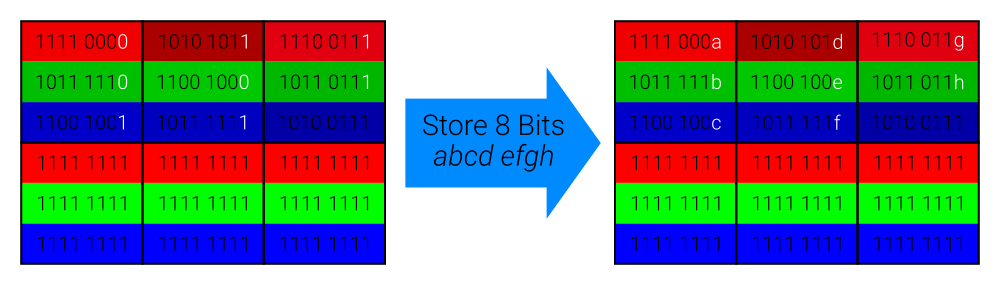

# png-steganography

This repository contains a Python script that stores an ASCII message in the least significant bit of the pixel color channels. It is very difficult to perceive the message in the visual image. However, when a message is known to be present, it can be recovered by analysing the image's pixel values. Hence, it is hidden in *plain sight*; which is what *steganography* entails.


## Explanation

Consider an RGB image of size 3x2. As there are 6 pixels, each with 3 color channels, a total of 18 bits can be stored. Assume a bitvector of length 8 will be stored in the image. The message is divided into its 8 individual bits (represented by bit variables a-h below). These bits replace the existing least significant bits in the color channels. This is depicted below.




## Example

Input                             | Output
:--------------------------------:|:-------------------------:
 | 

The difference between these images is not observable with the human eye. Yet, inspection of the pixel values in a graphics editor exposes small differences.


## Running

Running requires [Python 3](https://www.python.org/), with the following Python libraries:
* [Pillow](https://pillow.readthedocs.io/en/stable/installation.html) image library (`pip install pillow`)
* [bitarray](https://pypi.org/project/bitarray/) (`pip install bitarray`)

Then simply run with (where my `python` references `python3`):
```
python png_hide.py
```


## License

BSD-3 - See the `LICENSE` file

This license does *not* apply to the `example_input.png` and `example_output.png` files. Those images are taken (and adapted) from the Big Buck Bunny movie from the [Peach open movie project](https://peach.blender.org/about/) by the [Blender Foundation](https://www.blender.org/), and are licensed under [CC BY 3.0](https://creativecommons.org/licenses/by/3.0/).
